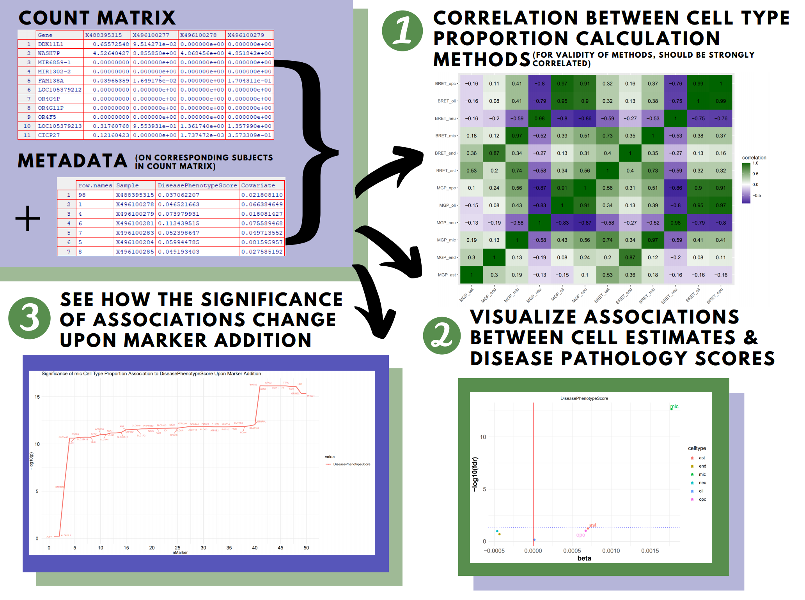

<!-- README.md is generated from README.Rmd. Please edit that file -->

# CellTyPETool

<!-- badges: start -->

<!-- badges: end -->

## Description

The goal of CellTyPETool is to facilitate research that requires
deconvolution of bulk-tissue RNAseq data. The package can be used to
generate cell type proportion estimations from bulk-tissue RNAseq using
two different validated methods, markerGeneProfile and BRETIGEA. While
other R packages have been published that calculate cell type
proportions (McKenzie et al, 2018; Mancarci et al., 2017), they only
offer their own analysis and not a comparison between, nor do they offer
visualizations between cell-type proportions associations with disease
or other important phenotypes. Additionally, they don’t offer simple way
to check which marker genes were encorporated in the cell-type
proportion calculation.

## Installation

To install the latest version of the package:

``` r
require("devtools")
devtools::install_github("meconsens/CellTyPETool", build_vignettes = TRUE)
library("CellTyPETool")
```

## Overview

``` r
data(package = "CellTyPETool")
ls("package:CellTyPETool")
```

CellTyPETool has 4 datasets.

The **bretCellMarkers** dataset is a dataframe with two columns: markers
and cell. The markers column contains marker genes for brain cell types
astrocyte, endothelial, microglia, neuron, oligodnedrocyte and
oligodendrocyte precursor. This is the marker gene list from the
*BRETIGEA* R package. The cell column indicates which of the cell types
( astrocyte, endothelial, microglia, neuron, oligodnedrocyte and
oligodendrocyte precursor cells) the marker gene is a marker for. The
dataset is formatted to be run by the *BRETIGEA* **findCells** method or
the CellTyPETool **findCellsMod** function.

The **mgpCellMarkers** dataset is a nested list with 6 sub-lists of
marker genes for brain cell types astrocyte, endothelial, microglia,
neuron, oligodnedrocyte and oligodendrocyte precursor cells.This is the
marker gene list from the *BRETIGEA* R package that has been reformatted
to be run by the *markerGeneProfile* **markerGeneProfile** method.

The **countDf** dataset is a dataframe with 395 rows of genes and 378
subjects taken from the *BRETIGEA* R package.

The **metadata** dataset is a dataframe with 345 subjects also in
countDf and 3 rows indicating the subjects id (Sample), some covariate
(covariate) and disease state score (DiseasePhenotypeScore). Sample is
the subjects id which corresponds to countDf, Covariate is some
confounding factor that must be accounted for when finding signals
between cell-type proportions and a disease phenotype (could be batch
etc.), DiseasePhenotypeScore is some indication of disease state, could
be a score of combined AD pathology variables (CERAD score, Braak
pathology stage etc.).

CellTyPETool contains 5 functions.

The **bretMarkerEffectOnPathology** function makes use of a modified
**findCells** function from *BRETIGEA* R package to a graph of the
significance of the cell type proportion specified’s association to the
pathology indicated upon marker addition from 0 to n.

The **markersPathology** function runs a linear model on the cell-type
proportion estimates by *BRETIGEA* R package **findCells** function.

The **findCellsMod** function is a modifed version of the **findCells**
function from the R package *BRETIGEA*, modified to return a list of
sample-by-cell type matrix of estimate cell type proportion variables
and the markers used.

The **calcAndCompare** function calculates cell type proportions using
two validated methods, **markerGeneProfile** and **findCells**, from the
*markerGeneProfile* and *BRETIGEA* R packages respectfully.

The **estimatesVPath** function generates a volcano plot showing the
significance of associations between each cell type proportion derived
and the pathology in question.

The **genesUsed** function returns the list of marker genes used in the
cell type proportions calculations of two validated methods,
**markerGeneProfile** and **findCells**, from the *markerGeneProfile*
and *BRETIGEA* R packages respectfully.

``` r
browseVignettes("CellTyPETool")
```

An overview of the package is illustrated below.



## Contributions

The author of the package is Micaela Consens.

The **bretMarkerEffectOnPathology** function makes use of a modified
**findCells** function from *BRETIGEA* R package to a graph of the
significance of the cell type proportion specified’s association to the
pathology indicated upon marker addition from 0 to n. The
**bretMarkerEffectOnPathology** function uses the *tidyr*, *dplyr*,
*tibble*, *scales*, *stats*, *utils*, *ggplot2*, *ggrepel*, and
*magrittr* packages.

The **markersPathology** function runs a linear model on the cell-type
proportion estimates by BRETIGEA. The **markersPathology** function uses
the *stats* and *magrittr* packages.

The **findCellsMod** function is a modifed version of the **findCells**
function from the R package *BRETIGEA*, modified to return a list of
sample-by-cell type matrix of estimate cell type proportion variables
and the markers used. (Part of the code for **findCellsMod** function
has been taken from *BRETIGEA* R package. Section of the borrowed code
is clearly indicated and referenced in the **findCellsMod** help file).
The **findCellsMod** function uses the *stats* package.

The **calcAndCompare** function calculates cell type proportions using
two validated methods, **markerGeneProfile** and **findCells**, from the
*markerGeneProfile* and *BRETIGEA* R packages respectfully. It then
compares the cell type proportions calculated by each. (Part of the code
for **findCellsMod** function has been taken from *BRETIGEA* and
*markerGeneProfile* and R package. Section of the borrowed code is
clearly indicated and referenced in the **calcAndCompare** help file).
The **calcAndCompare** function uses the *markerGeneProfile*,
*BRETIGEA*, *tibble*, *dplyr*, *stats*, *reshape*, *ggplot2*, and
*magrittr* package.

The **estimatesVPath** function generates a volcano plot showing the
significance of associations between each cell type proportion derived
and the pathology in question. It then generates a volcano plot to view
this. The **estimatesVPath** function uses the *stats*, *ggrepel*,
*ggplot2*, and *magrittr* package.

The **genesUsed** function returns the list of marker genes used in the
cell type proportions calculations of two validated methods,
**markerGeneProfile** and **findCells**, from the *markerGeneProfile*
and *BRETIGEA* R packages respectfully. (Part of the code for
**genesUsed** function has been taken from *BRETIGEA* and
*markerGeneProfile* and R package. Section of the borrowed code is
clearly indicated and referenced in the **genesUsed** help file). The
**genesUsed** function uses the *markerGeneProfile*, and *magrittr*
package.

## References

H. Wickham. Reshaping data with the reshape package. Journal of
Statistical Software, 21(12), 2007.

Hadley Wickham and Dana Seidel (2020). scales: Scale Functions for
Visualization. R package version 1.1.1.
<https://CRAN.R-project.org/package=scales>

Kamil Slowikowski (2020). ggrepel: Automatically Position
Non-Overlapping Text Labels with ‘ggplot2’.R package version 0.8.2.
<https://CRAN.R-project.org/package=ggrepel>

Kirill Müller and Hadley Wickham (2020). tibble: Simple Data Frames. R
package version 3.0.3. <https://CRAN.R-project.org/package=tibble>

Mancarci, B. O., Toker, L., Tripathy, S. J., Li, B., Rocco, B., Sibille,
E., & Pavlidis, P. (2017). CrossLaboratory Analysis of Brain Cell Type
Transcriptomes with Applications to Interpretation of Bulk Tissue Data.
eNeuro, 4(6), ENEURO.0212-17.2017.
<https://doi.org/10.1523/ENEURO.0212-17.2017>

McCarthy DJ, Chen Y and Smyth GK (2012). Differential expression
analysis of multifactor RNA-Seq experiments with respect to biological
variation. Nucleic Acids Research 40, 4288-4297

McKenzie, A.T., Wang, M., Hauberg, M.E. et al. Brain Cell Type Specific
Gene Expression and Coexpression Network Architectures. Sci Rep 8, 8868
(2018). <https://doi.org/10.1038/s41598-018-27293-5>

R Core Team (2020). R: A language and environment for statistical
computing. R Foundation for Statistical Computing, Vienna, Austria. URL
<https://www.R-project.org/>.

Stefan Milton Bache and Hadley Wickham (2014). magrittr: A Forward-Pipe
Operator for R. R package version 1.5.
<https://CRAN.R-project.org/package=magrittr>

Wickham et al., (2019). Welcome to the tidyverse. Journal of Open Source
Software, 4(43), 1686, <https://doi.org/10.21105/joss.01686>

Wickham H (2016). ggplot2: Elegant Graphics for Data Analysis.
Springer-Verlag New York. ISBN 978-3-319-24277-4,
<https://ggplot2.tidyverse.org>.

## Acknowledgements

This package was developed as part of an assessment for 2020 BCB410H:
Applied Bioinformatics, University of Toronto, Toronto,CANADA.
