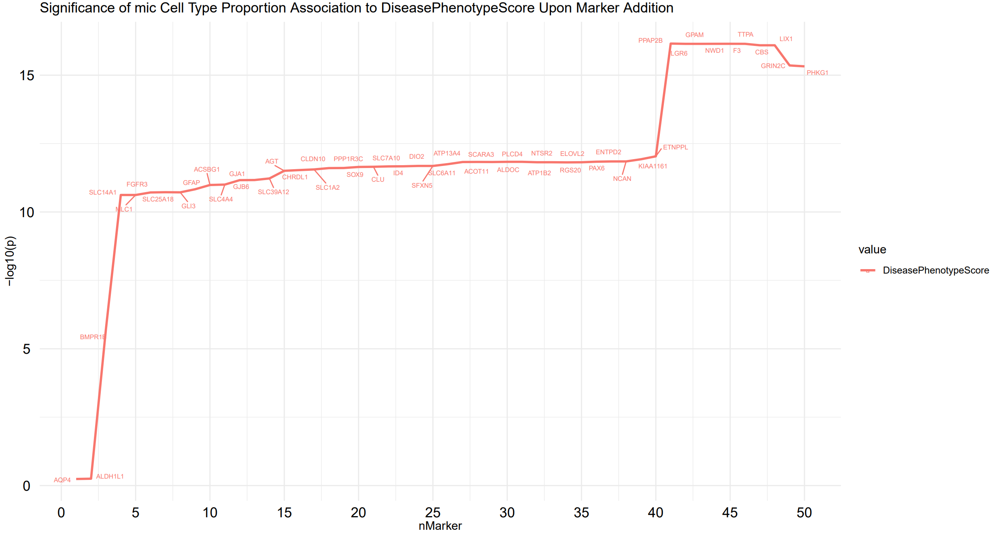
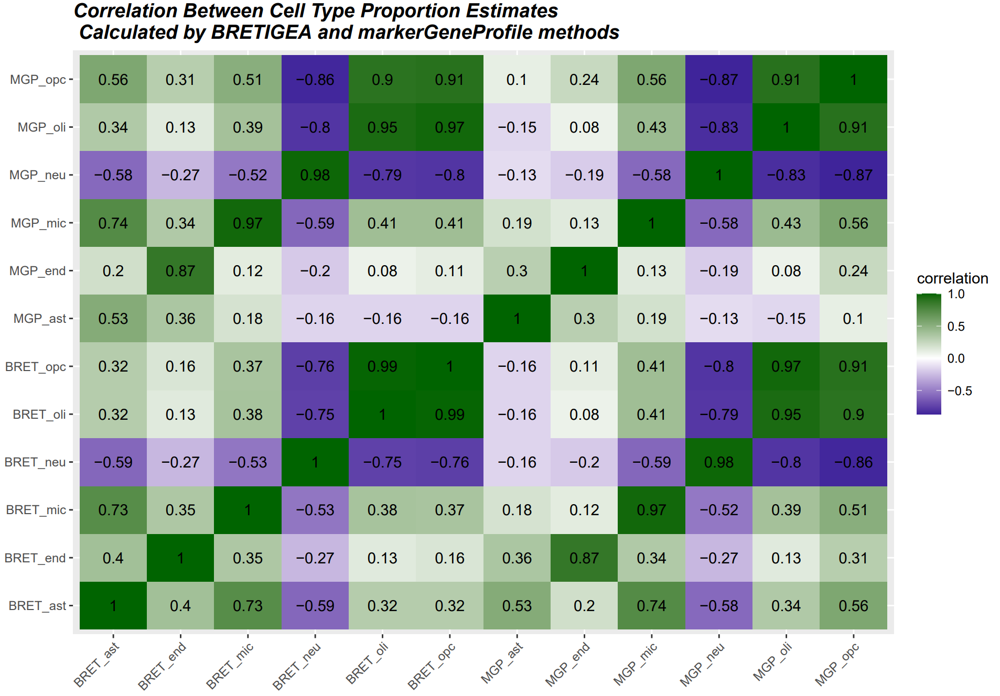
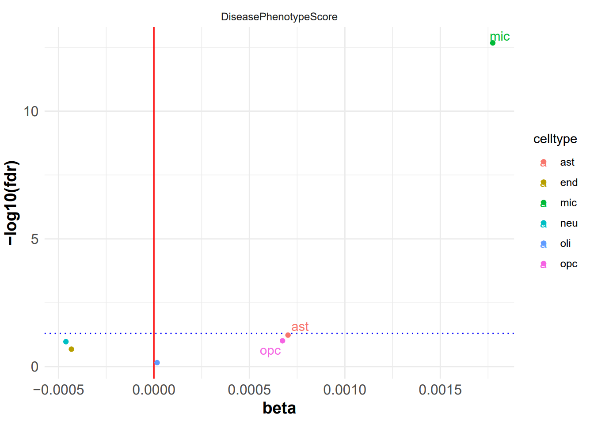

```{r, include = FALSE}
knitr::opts_chunk$set(
  collapse = TRUE,
  comment = "#>"
)
```

```{r setup}
library(CellTyPETool)
```

## Introduction

*CellTyPETool* is an R package to facilitate research that requires deconvolution of bulk-tissue RNAseq data. The package can be used to generate cell type proportion estimations from bulk-tissue RNAseq using two different validated methods, markerGeneProfile and BRETIGEA. **This document gives a tour of CellTyPETool (version 0.1.0) functionalities**. It was written in R Markdown, using the [knitr](https://cran.r-project.org/package=knitr) package for production. 

See `help(package = "CellTyPETool")` for further details and references provided by. To download *CellTyPETool*, use the following commands:

``` r
require("devtools")
devtools::install_github("meconsens/CellTyPETool", build_vignettes = TRUE)
library("CellTyPETool")
```
<br>


## Usage

The **bretMarkerEffectOnPathology** function makes use of a modified **findCells** function from *BRETIGEA* R package to a graph of the significance of the cell type proportion
specified's association to the pathology indicated upon marker addition from 0 to n.

The **markersPathology** function runs a linear model on the cell-type proportion estimates by *BRETIGEA* R package **findCells** function. 

The **findCellsMod** function is a modifed version of the **findCells** function from the R package *BRETIGEA*, modified to return a list of sample-by-cell type matrix of estimate cell type proportion variables and the markers used.

The **calcAndCompare** function calculates cell type proportions using two validated methods, **markerGeneProfile** and **findCells**, from the *markerGeneProfile* and *BRETIGEA* R packages respectfully.

The **estimatesVPath** function generates a volcano plot showing the significance of associations between each cell type proportion derived and the pathology in question. 

The **genesUsed** function returns the list of marker genes used in the cell type proportions calculations of two validated methods, **markerGeneProfile** and **findCells**, from the *markerGeneProfile* and *BRETIGEA* R packages respectfully. 


```r 
  data("countDf")
  data("metadata")
  data("bretCellMarkers")

  bretMarkerEffectOnPathologyResults <- CellTyPETool::bretMarkerEffectOnPathology(
    countDf = countDf,
    bretCellMarkers = bretCellMarkers,
    cellName = "mic",
    metadata = metadata,
    covar = "Covariate",
    pathologyName = "DiseasePhenotypeScore",
    cellTypeNames = unique(bretCellMarkers$cell),
    n= 10)
    
  bretMarkerEffectOnPathologyResults  
    
  calcAndCompareResults <- CellTyPETool::calcAndCompare (
    countDf = countDf,
    mgpCellMarkers = mgpCellMarkers,
    bretCellMarkers = bretCellMarkers)
  
  calcAndCompareResults$corrPlot
  
  estimatesVPathBretResults <- CellTyPETool::estimatesVPath(
    estimates = calcAndCompare$bret,
    metadata = metadata,
    cellTypeNames = unique(bretCellMarkers$cell),
    covar = "Covariate",
    pathologyName = "DiseasePhenotypeScore")
    
  estimatesVPathBretResults
    
  estimatesVPathMGPResults <- CellTyPETool::estimatesVPath(
    estimates = calcAndCompare$mgp,
    metadata = metadata,
    cellTypeNames = unique(bretCellMarkers$cell),
    covar = "Covariate",
    pathologyName = "DiseasePhenotypeScore")
  
   genesUsedResults <- CellTyPETool::genesUsed(
    countDf = countDf,
    mgpCellMarkers = mgpCellMarkers,
    bretCellMarkers = bretCellMarkers)
```
<br>

This will output various plots 
<div style="text-align:center">
<div style="text-align:left">

<div style="text-align:center">
<div style="text-align:left">

<div style="text-align:center">
<div style="text-align:left">


<div style="text-align:left">
## Package References

H. Wickham. Reshaping data with the reshape package. Journal of Statistical
  Software, 21(12), 2007.
  
Hadley Wickham and Dana Seidel (2020). scales: Scale Functions for
  Visualization. R package version 1.1.1.
  https://CRAN.R-project.org/package=scales

Kamil Slowikowski (2020). ggrepel: Automatically Position Non-Overlapping Text Labels with ‘ggplot2’.R package version 0.8.2. https://CRAN.R-project.org/package=ggrepel

Kirill Müller and Hadley Wickham (2020). tibble: Simple Data Frames. R package
  version 3.0.3. https://CRAN.R-project.org/package=tibble

Mancarci, B. O., Toker, L., Tripathy, S. J., Li, B., Rocco, B., Sibille, E., & Pavlidis, P. (2017). CrossLaboratory Analysis of Brain Cell Type Transcriptomes with Applications to Interpretation of Bulk Tissue Data. eNeuro, 4(6), ENEURO.0212-17.2017. https://doi.org/10.1523/ENEURO.0212-17.2017

McCarthy DJ, Chen Y and Smyth GK (2012). Differential expression analysis of multifactor RNA-Seq experiments with respect to biological variation. Nucleic Acids Research 40, 4288-4297

McKenzie, A.T., Wang, M., Hauberg, M.E. et al. Brain Cell Type Specific Gene Expression and Coexpression Network Architectures. Sci Rep 8, 8868 (2018). https://doi.org/10.1038/s41598-018-27293-5

R Core Team (2020). R: A language and environment for statistical computing. R
  Foundation for Statistical Computing, Vienna, Austria. URL
  https://www.R-project.org/.

Stefan Milton Bache and Hadley Wickham (2014). magrittr: A Forward-Pipe Operator for R. R package
version 1.5. https://CRAN.R-project.org/package=magrittr

Wickham et al., (2019). Welcome to the tidyverse. Journal of Open Source Software, 4(43), 1686,
https://doi.org/10.21105/joss.01686

Wickham H (2016). ggplot2: Elegant Graphics for Data Analysis. Springer-Verlag New York. ISBN 978-3-319-24277-4, https://ggplot2.tidyverse.org.

----

```{r}
sessionInfo()
```
